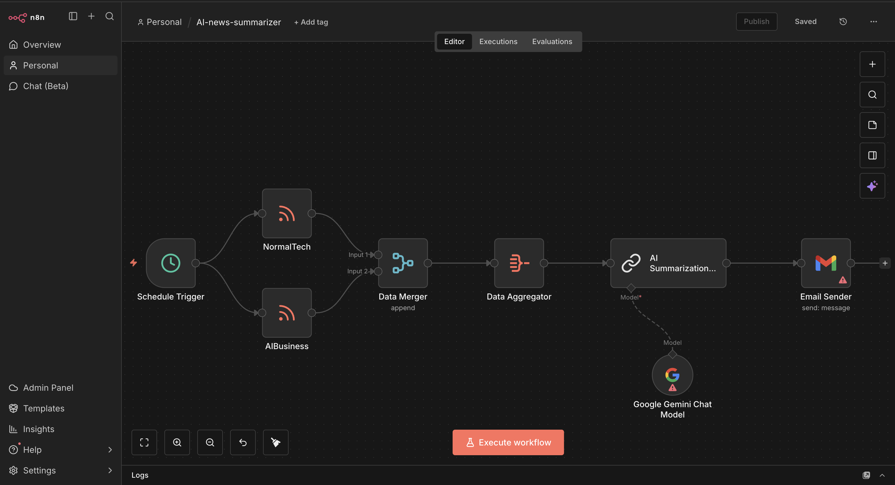

# 🤖 Automated News Summarizer

An AI-powered multi-tool agent that automatically fetches, summarizes, and generates insights from the latest news articles using advanced language models.



## 📋 Overview

The Automated News Summarizer is an intelligent system that leverages AI to streamline news consumption. It automatically retrieves news articles from various sources, processes them through sophisticated natural language processing models, and generates concise, actionable summaries.

## ✨ Features

- 🔍 **Automated News Fetching**:  Automatically retrieves the latest news from multiple sources
- 📝 **AI-Powered Summarization**:  Generates concise summaries using advanced language models
- 🎯 **Smart Categorization**:  Organizes news by topics and relevance
- 🔄 **Real-time Processing**: Processes news articles as they become available
- 📊 **Insights Generation**:  Extracts key insights and trends from news data
- 🛠️ **Multi-Tool Integration**:  Combines multiple AI tools for comprehensive analysis

## 🚀 Getting Started

### Prerequisites

- Python 3.8 or higher
- API keys for news sources and AI services

### Installation

```bash
# Clone the repository
git clone https://github.com/PreetKot/Automated-news-summarizer.git

# Navigate to the project directory
cd Automated-news-summarizer

# Install dependencies
pip install -r requirements.txt
```

### Configuration

1. Create a `.env` file in the root directory
2. Add your API keys and configuration:

```env
NEWS_API_KEY=your_news_api_key
AI_MODEL_KEY=your_ai_model_key
```

## 💻 Usage

```python
# Run the automated news summarizer
python main.py
```

## 🏗️ Architecture

The system consists of multiple components:

1. **News Fetcher**: Retrieves articles from configured sources
2. **Preprocessor**: Cleans and prepares text for analysis
3. **AI Summarizer**:  Generates summaries using LLMs
4. **Insight Extractor**: Identifies key trends and patterns
5. **Output Manager**: Formats and delivers results

## 🤝 Contributing

Contributions are welcome! Please feel free to submit a Pull Request.

1. Fork the project
2. Create your feature branch (`git checkout -b feature/AmazingFeature`)
3. Commit your changes (`git commit -m 'Add some AmazingFeature'`)
4. Push to the branch (`git push origin feature/AmazingFeature`)
5. Open a Pull Request

## 📄 License

This project is licensed under the MIT License - see the LICENSE file for details.

## 👤 Author

**PreetKot**

- GitHub: [@PreetKot](https://github.com/PreetKot)

## 🙏 Acknowledgments

- Thanks to all the AI and NLP libraries that make this possible
- News API providers for data access
- The open-source community for inspiration and support

---

⭐ Star this repository if you find it helpful! 
